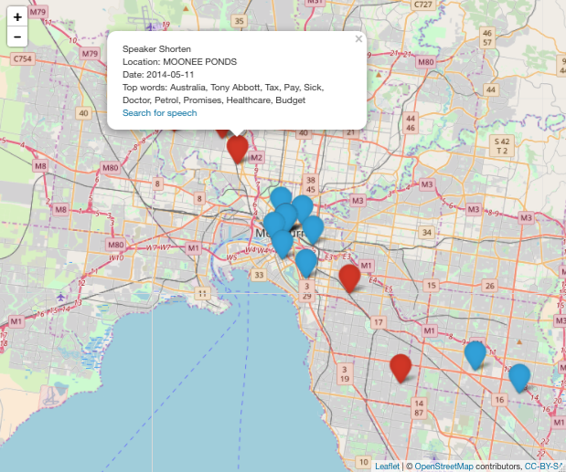

```{r setup, include=FALSE}
options(htmltools.dir.version = FALSE)
options(width = 60)
library(tidyverse)
```


---


---

class:  middle

# Motivation
### - Accessing and cleaning data in the real world
### - Wholistic, public, potential interest, SEARCHABLE, find events
### - Endless analysis possible, just a start, eg "Driving Debate" or "Sentiment"

---

class: middle

# Source

### - Inspecting media pages (transcipts, media releases and opinion pieces)
### - Engineering a method to systimaticall crawl the site
### - Understanding the typical layout of a media page

---
class: middle

# Scrape

### - rvest (web scraping html pages)
### - cloudyr (a open source project with many clients to cloud computing services)
- awspack
- aws.s3
- googleCloudStorageR


.footnote[[hadley/rvest](github.com/hadley/rvest)  -  [cloudyr](github.com/cloudyr)]

---
class: middle
```{r, echo = F, warning=F, message=F}
library(rvest)

h <- read_html("html/shorten_transcipts.html")

```

```{r, echo=T, eval=F}
library(rvest)

h <- read_html("http://www.billshorten.com.au/transcripts")
```


Extracting anchors/links on the page:
```{r, echo=T}

anchors <- html_nodes(h, "a")

```

An example:

`<a href=\"/transcript_doorstop_canberra_monday_27_november_2017\">
TRANSCRIPT - DOORSTOP - CANBERRA - MONDAY, 27 NOVEMBER 2017 </a>`

---
class: middle

`<a href=\"/transcript_doorstop_canberra_monday_27_november_2017\">
TRANSCRIPT - DOORSTOP - CANBERRA - MONDAY, 27 NOVEMBER 2017 </a>`

Separate the text and the `href`:
```{r, eval=F}
html_text(anchors)
```
"TRANSCRIPT - DOORSTOP - CANBERRA - MONDAY, 27 NOVEMBER 2017"
```{r, eval=F}
html_attr(anchors, "href")
```
"/transcript_doorstop_canberra_monday_27_november_2017"

---

class: middle

# Managing errors

Safely catch errors and respond to them:

```{r, eval=F}
h <- read_html("http://www.billshorten.com.au/transcript")
```
`Error in open.connection(x, "rb") : HTTP error 404.`


---

class: middle

```{r}
safe_read_html <- purrr::safely(read_html)

h <- safe_read_html("http://www.billshorten.com.au/transcript")

h

h <- safe_read_html("http://www.billshorten.com.au/transcripts")

h

```


---
class: middle

# Processing/Cleaning
```{html, eval=F}
div class="headline">
  <h2>TRANSCRIPT - DOORSTOP - MELBOURNE - FRIDAY, 26 JANUARY 2018</h2>
</div>

<div id="content">

  <div id="intro" class="intro">
    <div class="content">
      <p><strong>E&amp;OE TRANSCRIPT<br></strong><strong>DOORSTOP<br></strong><strong>MELBOURNE<br></strong><strong>FRIDAY, 26 JANUARY 2018</strong></p>
<p><strong>SUBJECT/S: <em>Australian of the Year, trade, Australia Day, republic, cost of living. </em></strong></p><p><strong>BILL SHORTEN, LEADER OF THE OPPOSITION:</strong> Good morning everybody. I’m fortunate to be in the western Suburbs of Melbourne, welcoming 150 new Australian citizens.</p>
<p>I’d like to congratulate Australian of the Year, Michelle Simmons. Her win is a win for her and her personal hard work, but it’s also a win for science, and it’s </p>
<p>Happy to take any questions that people might have.</p>
<p><strong>JOURNALIST:</strong> Is there any hope now that the US can re-join the TPP deal?</p>
<p><strong>SHORTEN:</strong> I think first of all we need to see if this new trade agreement stacks up. Let me be very clear, this is not the old Trans Pacific Partnership which included the United States. I was right when I said that Donald Trump had walked away from that, and he hasn’t come back. But this new arrangement, whilst it’s much </p>
<p>If it stacks up, Labor will give it the tick, if it doesn’t stack up then we’re not going to give it the tick. What we need to do is always watch out for the interests of working and middle-class Aussies, </p>
<p><strong>JOURNALIST:</strong> Just back on Australia Day, we’ve already seen a few far right rallyists go to citizenship ceremonies and they’ll be holding an event in St Kilda today, what do you have to say to those people?</p>
```

---

#### Aidans ratio method
#### boilerpipeR

.footnote[[mannau/boilerpipeR](github.com/mannau/boilerpipeR)]
---

## Comparing methods

---

class: middle

```{r, eval=F}

library(boilerpipeR)

DefaultExtractor()
ArticleExtractor()
KeepEverythingExtractor()
LargestContentExtractor()
NumWordsRulesExtractor()

```


---

## tidytext

- Tokenize a string
- Splitting a speech into sentences, phrases and words

```{r}
library(tidytext)


text_df <- tibble(
  text = "We have to remember that Australia is part of a big integrated global economy."
)
```


.footnote[[juliasilge/tidytext](github.com/juliasilge/tidytext)]
---

class: middle

```{r}
unnest_tokens(text_df, word, text)
```

---

class: middle

```{r}
unnest_tokens(text_df, word, text, "ngrams", n = 3)
```

---

class: middle, center


---

## Using Natural Language Processing (NLP)

- Named Entity Recognition (NER)
- people, places, organisations, currency, dates, times

"It's great to be in Burnie at the University of Tasmania Campus here with my colleague Senator Anne Urquhart."

`NLP` and `openNLP`
```{r, echo=F}
people <- c("Anne Urquhart");
orgs <- c("University of Tasmania")
places <- c("Burnie")
```
```{r, eval=F}
person_ann <- Maxent_Entity_Annotator(kind = "person")
location_ann <- Maxent_Entity_Annotator(kind = "location")
organization_ann <- Maxent_Entity_Annotator(kind = "organization")

people <- entities(sent, kind = "person")
places <- entities(bio_doc, kind = "location")
orgs <- entities(bio_doc, kind = "organization")
```

---

class: middle

"It's great to be in Burnie at the University of Tasmania Campus here with my colleague Senator Anne Urquhart."

```{r}
people
places
orgs
```

---
class: middle

## Sentiment Analysis

- `RSentiment` and `tidytext`
- Scoring sentences on a spectrum of negativity and positivity

.footnote[[RSentiment](http://cran.r-project.org/package=RSentiment)  -  [juliasilge/tidytext](http://github.com/juliasilge/tidytext)]

---
class: middle

```{r, eval= F}
library(RSentiment)
```

"The real problem here is that the people of Australia don't like the Government because they're so hopelessly out of touch."

```{r, eval=F}
sentence_chr <- "The real problem here is that the people of Australia don't like the Government because they're so hopelessly out of touch."
calculate_sentiment(sentence_chr)
```
```{r, echo=F}
"Very Negative"
```

"It's fabulous to be back in Queensland - coming into the home straight ready to hit the line strong."
```{r, eval=F}
sentence_chr <- "It's fabulous to be back in Queensland - coming into the home straight ready to hit the line strong."
calculate_sentiment(sentence_chr)
```
```{r, echo=F}
"Very Positive"
```


---

class: middle

### Identifying whose words are who's


---

# String Manipulation

```{r, eval=F}
library(dplyr)
library(stringr)
```


```{r, echo=F, message=F, warning=F}
library(dplyr)
library(stringr)
df_speech <- readr::read_rds("data/lignin.rds") %>% 
  tibble::tibble(sent = .)
```

```{r}
df_speech
```

.footnote[[tidyverse/stringr](https://github.com/tidyverse/stringr)]

---

class: middle

```{r}
df_speech <- mutate(df_speech, who = case_when(
  str_detect(sent, "JOURNALIST:") ~ "Jrn",
  str_detect(sent, "SHORTEN:") ~ "BS",
  str_detect(sent, "TURNBULL|PRIME MINISTER:") ~ "MT",
  str_detect(sent, "[[:upper:]]:") ~ "Other"
  )) %>% 
  tidyr::fill(who)

df_speech
```


---
class: middle


# A useable data set!


- ~2500 speeches
- ~130,000 sentences
- going back 4 years

- Features including:
-- Speaker
-- Location
-- Date
-- Sentiment

---
class: middle

# Visualisation and Exloration Tools

### - shiny (simple interactive web apps) 
### - plotly (interactive visualisatons) 
### - leaflet (interactive maps)

.footnote[
[rstudio/shiny](http://github.com/rstudio/shiny) - [ropensci/plotly](http://github.com/ropensci/plotly) - [rstudio/leaflet](http://github.com/rstudio/leaflet)]
---

class: middle

# Analysis

### - Who drives debate?
### - Language and Location

### - Sentiment
### - Favouraite Phrases

---

class: middle

# Location Analysis


```{r, eval=F}

ggmap::geocode("Bega", source = "dsk")

```

```{r, echo=F}
message(glue::glue("Information from URL : http://www.datasciencetoolkit.org/maps/
                   api/geocode/json?address=Bega&sensor=false"))

tibble(lon = 149.8418, lat = -36.67392)
```

.footnote[[dkahle/ggmap](https://github.com/dkahle/ggmap)]

---

class: middle, center

# Australia


---

class: middle, center

# Melbourne


---

class: middle, center

# Melbourne




---

class: middle, center

# Melbourne


---

class: middle, center

# Sentence Length by Location 


---

class: middle, center

# Sentence Length by Location 

```{r, echo=F, warning=F, message=F, fig.width=10}
library(ggridges)
syd_df <- read_rds("data/ridges_plot.rds")
ggplot(syd_df, aes(x = sent.lenth, y = label, fill = label)) +
  geom_density_ridges() +
  xlim(-10, 75) +
  ylab("") +
  xlab("Sentence Length") +
  theme(legend.position = "none", text = element_text(size=20))


```


---
